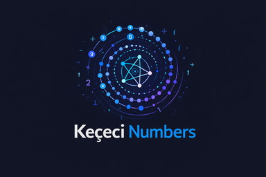

# Keçeci Numbers: Keçeci Sayıları (Keçeci Conjecture)
---

# Keçeci Numbers 

[](https://badge.fury.io/py/kececinumbers/)
[](https://opensource.org/license/agpl-3-0)
[](https://doi.org/10.5281/zenodo.15377659)
[](https://doi.org/10.48546/workflowhub.datafile.14.2)
[](https://doi.org/10.6084/m9.figshare.29816414)

[](https://anaconda.org/bilgi/kececinumbers)
[](https://anaconda.org/bilgi/kececinumbers)
[](https://anaconda.org/bilgi/kececinumbers)
[](https://anaconda.org/bilgi/kececinumbers)

[](https://opensource.org/)
[](https://kececinumbers.readthedocs.io/en/latest)
[](https://www.bestpractices.dev/projects/10536)

[](https://github.com/WhiteSymmetry/kececinumbers/actions/workflows/python_ci.yml)
[](https://codecov.io/gh/WhiteSymmetry/kececinumbers)
[](https://kececinumbers.readthedocs.io/en/latest/)
[](https://terrarium.evidencepub.io/v2/gh/WhiteSymmetry/kececinumbers/HEAD)

[](https://badge.fury.io/py/kececinumbers)
[](CODE_OF_CONDUCT.md)
[](https://github.com/astral-sh/ruff)
[](https://python.org/)

[](https://pepy.tech/projects/kececinumbers)

[](https://pepy.tech/projects/kececinumbers)

---

<p align="left">
    <table>
        <tr>
            <td style="text-align: center;">PyPI</td>
            <td style="text-align: center;">
                <a href="https://pypi.org/project/kececinumbers/">
                    
                </a>
            </td>
        </tr>
        <tr>
            <td style="text-align: center;">Conda</td>
            <td style="text-align: center;">
                <a href="https://anaconda.org/bilgi/kececinumbers">
                    
                </a>
            </td>
        </tr>
        <tr>
            <td style="text-align: center;">DOI</td>
            <td style="text-align: center;">
                <a href="https://doi.org/10.5281/zenodo.15377659">
                    
                </a>
            </td>
        </tr>
        <tr>
            <td style="text-align: center;">License: AGPL</td>
            <td style="text-align: center;">
                <a href="https://opensource.org/licenses/AGPL">
                    
                </a>
            </td>
        </tr>
    </table>
</p>

---

**Keçeci Numbers** is a Python library for generating, analyzing, and visualizing dynamic sequences inspired by the Collatz Conjecture across diverse number systems.

This library provides a unified algorithm that operates on 23 different number types, from standard integers to complex algebraic structures like quaternions and neutrosophic numbers. It is designed as a tool for academic research and exploration in number theory.

<details>
<summary>🇹🇷 Türkçe Açıklama (Click to expand)</summary>

**Keçeci Sayıları**, Collatz Varsayımı'ndan esinlenen ve farklı sayı sistemlerinde dinamik diziler üreten, analiz eden ve görselleştiren bir Python kütüphanesidir. Bu kütüphane, tamsayılardan karmaşık sayılara, kuaterniyonlardan nötrosofik sayılara kadar 23 farklı sayı türü üzerinde çalışan birleşik bir algoritma sunar. Akademik araştırmalar ve sayı teorisindeki keşifler için bir araç olarak tasarlanmıştır.

</details>

---

## Türkçe

### Keçeci Sayıları Nedir?

Keçeci Sayıları, bir başlangıç değerinden özyineli (rekürsif) bir kuralla üretilen sayı dizileridir. Her adımda şu süreç izlenir:

1.  **Ekle ve Kaydet:** Geçerli değere sabit bir artış değeri eklenir ve bu yeni "eklenmiş değer" diziye kaydedilir.
2.  **Bölmeyi Dene:** "Eklenmiş değer", bir önceki adımda kullanılmayan sayıya (2 veya 3) bölünmeye çalışılır. Bölme başarılı olursa, sonuç bir sonraki eleman olur.
3.  **ASK (Artır/Azalt ve Kontrol Et) Kuralı:** Eğer sayı bölünemiyor ve ana bileşeni asal ise, türe özgü bir birim değer eklenir veya çıkarılır. Elde edilen bu "değiştirilmiş değer" kaydedilir ve bölme işlemi yeniden denenir.
4.  **Aktar:** Bölme yine başarısız olursa veya sayı asal değilse, mevcut değer (eklenmiş veya değiştirilmiş değer) doğrudan dizinin bir sonraki elemanı olur.

Bu esnek mekanizma, 23 farklı sayı türünde (Pozitif Reel'den Hiperkomplekse, Nötrosofik'ten Ternary'ye kadar) başarıyla test edilmiş olup, sayı dizilerinin çeşitli cebirsel sistemlerdeki davranışını incelemek için zengin ve evrensel bir çerçeve sunar.

**Son Genişlemeler ve Ulaşılan Olgular:**

Tüm bu türlerde, diziler içinde "Keçeci Asal Sayıları (KPN)" olarak adlandırılan, tekrar eden ve asal olan özel sayılar keşfedilmiştir. Bu KPN'lerin dizilerdeki ardışık konumları arasındaki maksimum boşluklar analiz edildiğinde, boşluk oranının (Cramér'in (log N)² sınırına göre) tüm türlerde 1'in oldukça altında kaldığı ampirik olarak doğrulanmıştır. Bu bulgu, "Keçeci-Cramér Konjektürü"nün sadece klasik sayılarda değil, standart olmayan sayı kümelerinde de geçerli olduğunu göstermekte ve asal-benzeri sayıların dağılımına dair yeni bir bakış açısı kazandırmaktadır.

---

## English

### What are Keçeci Numbers?

Keçeci Numbers are sequences generated from a starting value using a recursive rule. The process for each step is:

1.  **Add & Record:** A fixed increment value is added to the current value, and this new "added value" is recorded in the sequence.
2.  **Attempt Division:** An attempt is made to divide the "added value" by either 2 or 3 (whichever was not used in the previous step). If successful, the result becomes the next element.
3.  **ASK (Augment/Shrink then Check) Rule:** If the number is indivisible and its principal component is prime, a type‑specific unit value is either added (augment) or subtracted (shrink). This "modified value" is recorded, and the division is re‑attempted.
4.  **Carry Over:** If division fails again, or if the number is not prime, the current value (either the "added value" or the "modified value") becomes the next element in the sequence.

This flexible mechanism has been successfully tested across 23 distinct number types—ranging from Positive Real to Hypercomplex, and including Neutrosophic, Ternary, and Quaternionic algebras—providing a rich and universal framework for studying the behavior of numerical sequences in various algebraic systems.

**Recent Extensions and Established Facts:**

Within all of these types, special repeating prime numbers called "Keçeci Prime Numbers (KPN)" have been identified. Analysis of the maximum gaps between consecutive KPN positions in the sequences has empirically confirmed that the gap ratio (normalized by Cramér's (log N)² bound) remains well below 1 for every tested type. This finding demonstrates that the "Keçeci–Cramér Conjecture" holds not only for classical integers but also across non‑standard number systems, offering a new perspective on the distribution of prime‑like numbers.

## Key Features

*   **23 Different Number Types:** Supports integers, rationals, complex numbers, quaternions, neutrosophic numbers, and more.
*   **Unified Generator:** Uses a single, consistent `unified_generator` algorithm for all number types.
*   **Advanced Visualization:** Provides a multi-dimensional `plot_numbers` function tailored to the nature of each number system.
*   **Keçeci Prime Number (KPN) Analysis:** Identifies the most recurring prime representation in sequences to analyze their convergence behavior.
*   **Interactive and Programmatic Usage:** Supports both interactive parameter input (`get_interactive`) and direct use in scripts (`get_with_params`).

*   0.9.5: 23 Numbers
*   0.8.2: 22 Numbers
*   0.7.9: 20 Numbers
*   0.7.8: 16 Numbers
*   0.6.7: 11 Numbers

---

## MODULE CONSTANTS: KEÇECİ NUMBER TYPES

type_names = {
        1: "Positive Real",
        2: "Negative Real",
        3: "Complex",
        4: "Float",
        5: "Rational",
        6: "Quaternion",
        7: "Neutrosophic",
        8: "Neutro-Complex",
        9: "Hyperreal",
        10: "Bicomplex",
        11: "Neutro-Bicomplex",
        12: "Octonion",
        13: "Sedenion",
        14: "Clifford",
        15: "Dual",
        16: "Split-Complex",
        17: "Pathion",
        18: "Chingon",
        19: "Routon",
        20: "Voudon",
        21: "Super Real",
        22: "Ternary",
        23: "Hypercomplex",
    }


TYPE_POSITIVE_REAL = 1

TYPE_NEGATIVE_REAL = 2

TYPE_COMPLEX = 3

TYPE_FLOAT = 4

TYPE_RATIONAL = 5

TYPE_QUATERNION = 6

TYPE_NEUTROSOPHIC = 7

TYPE_NEUTROSOPHIC_COMPLEX = 8

TYPE_HYPERREAL = 9

TYPE_BICOMPLEX = 10

TYPE_NEUTROSOPHIC_BICOMPLEX = 11

TYPE_OCTONION = 12

TYPE_SEDENION = 13

TYPE_CLIFFORD = 14

TYPE_DUAL = 15

TYPE_SPLIT_COMPLEX = 16

TYPE_PATHION = 17

TYPE_CHINGON = 18

TYPE_ROUTON = 19

TYPE_VOUDON = 20

TYPE_SUPERREAL = 21

TYPE_TERNARY = 22

TYPE_HYPERCOMPLEX = 23

---

INFO: kececinumbers v0.9.5 loaded successfully

🎯 Test of Keçeci Numbers/Keçeci Sayıları Testi
T  Tip           +     ×     -     ÷    OK%
--------------------------------------------------
 1 POSITIVE_REAL 1.0 1.0 1.0 1.0  ✅
 2 NEGATIVE_REAL 1.0 1.0 1.0 1.0  ✅
 3 COMPLEX      1.0 1.0 1.0 1.0  ✅
 4 FLOAT        1.0 1.0 1.0 1.0  ✅
 5 RATIONAL     1.0 1.0 1.0 1.0  ✅
 6 QUATERNION   1.0 1.0 1.0 1.0  ✅
 7 NEUTROSOPHIC 1.0 1.0 1.0 1.0  ✅
 8 NEUTROSOPHIC_COMPLEX 1.0 1.0 1.0 1.0  ✅
 9 HYPERREAL    1.0 1.0 1.0 1.0  ✅
10 BICOMPLEX    1.0 1.0 1.0 1.0  ✅
11 NEUTROSOPHIC_BICOMPLEX 1.0 1.0 1.0 1.0  ✅
12 OCTONION     1.0 1.0 1.0 1.0  ✅
13 SEDENION     1.0 1.0 1.0 1.0  ✅
14 CLIFFORD     1.0 1.0 1.0 1.0  ✅
15 DUAL         1.0 1.0 1.0 1.0  ✅
16 SPLIT_COMPLEX 1.0 1.0 1.0 1.0  ✅
17 PATHION      1.0 1.0 1.0 1.0  ✅
18 CHINGON      1.0 1.0 1.0 1.0  ✅
19 ROUTON       1.0 1.0 1.0 1.0  ✅
20 VOUDON       1.0 1.0 1.0 1.0  ✅
21 SUPERREAL    1.0 1.0 1.0 1.0  ✅
22 TERNARY      1.0 1.0 1.0 1.0  ✅
23 HYPERCOMPLEX 1.0 1.0 1.0 1.0  ✅

---

## Installation

You can easily install the project using **Conda** or Pip but intall "**conda install -c conda-forge quaternion**", "**conda install -c conda-forge quaternion -y --force-reinstall**",
or isntall with "**pip install -U numpy-quaternion**" but is not "quaternion":

```bash
# Install with Conda
conda install -c bilgi kececinumbers

# Install with Pip
pip install kececinumbers

# extras_require

# Pip için explicit
quaternion-pip: ["numpy-quaternion"]: pip install numpy-quaternion

# Conda için explicit
quaternion-conda: ["quaternion"]: conda install quaternion 
```

---

## Quick Start

The following example generates and visualizes a Keçeci sequence with POSITIVE_REAL numbers.

```python
import kececinumbers as kn
import matplotlib.pyplot as plt
from typing import Any, Dict, List, Tuple
import logging
logging.basicConfig(level=logging.INFO, format="%(levelname)s: %(message)s")

if __name__ == "__main__":
    # Call the interactive function from the Keçeci Numbers module
    generated_sequence, used_params = kn.get_interactive()
    
    # If a sequence was successfully generated, print the results and plot the graph
    if generated_sequence:
        print("\n--- Results ---")
        print(f"Parameters Used: {used_params}")
        print(f"Generated Sequence (first 30 elements): {generated_sequence[:30]}")
        
        # Optionally, plot the graph
        kn.plot_numbers(generated_sequence)
        plt.show()
```

or

```python
import matplotlib.pyplot as plt
import kececinumbers as kn
import logging
logging.basicConfig(level=logging.INFO, format="%(levelname)s: %(message)s")

sequence = kn.get_with_params(
    kececi_type_choice=kn.TYPE_POSITIVE_REAL,
    iterations=30,
    start_value_raw="0.0",
    add_value_raw="9.0",
    include_intermediate_steps=True
)

if sequence:
    kn.plot_numbers(sequence, title="My First POSITIVE_REAL Keçeci Sequence")
    plt.show()

    # Optionally, find and print the Keçeci Prime Number (KPN)
    kpn = kn.find_kececi_prime_number(sequence)
    if kpn:
        print(f"\nKeçeci Prime Number (KPN) found: {kpn}")
```


---        

The following example generates and visualizes a Keçeci sequence with complex numbers.

```python
import matplotlib.pyplot as plt
import kececinumbers as kn
import sympy
import re
from collections import Counter

# ------------------------------------------------------------------
# Ana program
# ------------------------------------------------------------------
seq = kn.get_with_params(
    kececi_type_choice=kn.TYPE_COMPLEX,
    iterations=60,
    start_value_raw="1+1j",
    add_value_raw="0.1+0.1j",
    include_intermediate_steps=True
)

if seq:
    kn.plot_numbers(seq, title="Complex Keçeci Numbers Example")
    plt.show()

    kpn = kn.safe_find_kpn(seq, type_num=3)          # <--- Güvenli KPN bulucu
    if kpn:
        print(f"\nKeçeci Prime Number (KPN) found for this sequence: {kpn}")
    else:
        print("\nKPN bulunamadı.")
```


```python
import kececinumbers as kn

seq = kn.get_with_params(
    kececi_type_choice=kn.TYPE_COMPLEX,
    iterations=60,
    start_value_raw="1+1j",
    add_value_raw="0.1+0.1j",
    include_intermediate_steps=True
)
kpn = kn.safe_find_kpn(seq, type_num=3)  # type_num isteğe bağlı
print(kpn)
```

---

## The Keçeci Conjecture

> For every Keçeci Number type, sequences generated by the `unified_generator` function are conjectured to converge to a periodic structure or a recurring prime representation (Keçeci Prime Number, KPN) in a finite number of steps. This behavior can be viewed as a generalization of the Collatz Conjecture to multiple algebraic systems.

This conjecture remains unproven, and this library provides a framework for testing it.

<details>
<summary>Click for the conjecture in other languages (Diğer diller için tıklayın)</summary>

*   **🇹🇷 Türkçe:** Her Keçeci Sayı türü için, `unified_generator` fonksiyonu tarafından oluşturulan dizilerin, sonlu adımdan sonra periyodik bir yapıya veya tekrar eden bir asal temsiline (Keçeci Asal Sayısı, KPN) yakınsadığı sanılmaktadır.
*   **🇩🇪 Deutsch:** Es wird vermutet, dass die vom `unified_generator` erzeugten Sequenzen für jeden Keçeci-Zahl-Typ nach endlich vielen Schritten gegen eine periodische Struktur oder eine wiederkehrende Primdarstellung (KPN) konvergieren.

</details>
---

## Description / Açıklama

**Keçeci Numbers (Keçeci Sayıları)**: Keçeci Numbers; An Exploration of a Dynamic Sequence Across Diverse Number Sets: This work introduces a novel numerical sequence concept termed "Keçeci Numbers." Keçeci Numbers are a dynamic sequence generated through an iterative process, originating from a specific starting value and an increment value. In each iteration, the increment value is added to the current value, and this "added value" is recorded in the sequence. Subsequently, a division operation is attempted on this "added value," primarily using the divisors 2 and 3, with the choice of divisor depending on the one used in the previous step. If division is successful, the quotient becomes the next element in the sequence. If the division operation fails, the primality of the "added value" (or its real/scalar part for complex/quaternion numbers, or integer part for rational numbers) is checked. If it is prime, an "Augment/Shrink then Check" (ASK) rule is invoked: a type-specific unit value is added or subtracted (based on the previous ASK application), this "modified value" is recorded in the sequence, and the division operation is re-attempted on it. If division fails again, or if the number is not prime, the "added value" (or the "modified value" post-ASK) itself becomes the next element in the sequence. This mechanism is designed to be applicable across various number sets, including positive and negative real numbers, complex numbers, floating-point numbers, rational numbers, and quaternions. The increment value, ASK unit, and divisibility checks are appropriately adapted for each number type. This flexibility of Keçeci Numbers offers rich potential for studying their behavior in different numerical systems. The patterns exhibited by the sequences, their convergence/divergence properties, and potential for chaotic behavior may constitute interesting research avenues for advanced mathematical analysis and number theory applications. This study outlines the fundamental generation mechanism of Keçeci Numbers and their initial behaviors across diverse number sets.

---

## Installation / Kurulum

```bash
conda install bilgi::kececinumbers -y

pip install kececinumbers
```
https://anaconda.org/bilgi/kececinumbers

https://pypi.org/project/kececinumbers/

https://github.com/WhiteSymmetry/kececinumbers

https://zenodo.org/records/15377660

https://zenodo.org/records/

---

## Usage / Kullanım

### Example

```python
import matplotlib.pyplot as plt
import kececinumbers as kn
import logging
logging.basicConfig(level=logging.INFO, format="%(levelname)s: %(message)s")

print("--- Interactive Test ---")

# Adım 1: get_interactive'ten dönen 2 değeri al (dizi ve parametre sözlüğü)
# Hata bu satırdaydı. Fonksiyon 2 değer döndürüyor, 5 değil.
seq_interactive, params = kn.get_interactive()

# Fonksiyon bir dizi döndürdüyse (başarılıysa) devam et
if seq_interactive:
    # Adım 2: Tip numarasını ve ismini al
    # Gerekli tüm bilgiler zaten `params` sözlüğünde mevcut.
    type_choice = params['type_choice']
    
    type_names = [
        "Positive Real", "Negative Real", "Complex", "Float", "Rational", 
        "Quaternion", "Neutrosophic", "Neutro-Complex", "Hyperreal", 
        "Bicomplex", "Neutro-Bicomplex", "Octonion", "Sedenion", "Clifford",
        "Dual", "Split-Complex", "Pathion", "Chingon", "Routon", "Voudon",
        "Super Real", "Ternary", "Hypercomplex"
    ]
    # type_name'i params sözlüğüne ekleyerek raporu zenginleştirelim
    params['type_name'] = type_names[type_choice - 1]

    # Adım 3: Ayrıntılı raporu yazdır
    # Fonksiyondan dönen params sözlüğünü doğrudan kullanıyoruz.
    kn.print_detailed_report(seq_interactive, params)
    
    # Adım 4: Grafiği çizdir
    print("\nDisplaying plot...")
    plot_title = f"Interactive Keçeci Sequence ({params['type_name']})"
    kn.plot_numbers(seq_interactive, plot_title)
    plt.show()

else:
    print("Sequence generation was cancelled or failed.")
```

```python
import matplotlib.pyplot as plt
import kececinumbers as kn
import logging
logging.basicConfig(level=logging.INFO, format="%(levelname)s: %(message)s")

# Matplotlib grafiklerinin notebook içinde gösterilmesini sağla
%matplotlib inline

print("Trying interactive mode (will prompt for input in the console/output area)...")

# DÜZELTİLMİŞ KISIM:
# get_interactive'ten dönen iki değeri ayrı değişkenlere alıyoruz.
# 'seq' listenin kendisi, 'params' ise parametre sözlüğüdür.
seq, params = kn.get_interactive()

# Sadece dizi (seq) başarılı bir şekilde oluşturulduysa devam et
if seq:
    print("\nSequence generated successfully. Plotting...")
    # plot_numbers fonksiyonuna artık doğru şekilde SADECE listeyi gönderiyoruz.
    kn.plot_numbers(seq, title=f"Interactive Keçeci Numbers ({params.get('type_name', '')})")
    # Grafiği göstermek için plt.show() ekleyelim
    plt.show() 
else:
    print("\nSequence generation failed or was cancelled.")


print("\nDone with examples.")
print("Keçeci Numbers Module Loaded.")
print("This module provides functions to generate and plot Keçeci Numbers.")
print("Example: Use 'import kececinumbers as kn' in your script/notebook.")
print("\nAvailable functions:")
print("- kn.get_interactive()")
print("- kn.get_with_params(kececi_type, iterations, ...)")
print("- kn.get_random_type(iterations, ...)")
print("- kn.plot_numbers(sequence, title)")
print("- kn.unified_generator(...) (low-level)")
```
---
Trying interactive mode (will prompt for input in the console/output area)...

Keçeci Number Types:

1: Positive Real Numbers (Integer: e.g., 1)

2: Negative Real Numbers (Integer: e.g., -3)

3: Complex Numbers (e.g., 3+4j)

4: Floating-Point Numbers (e.g., 2.5)

5: Rational Numbers (e.g., 3/2, 5)

6: Quaternions (scalar start input becomes q(s,s,s,s): e.g.,  1 or 2.5)

7: Neutrosophic     

8: Neutro-Complex   

9: Hyperreal
 
10: Bicomplex        

11: Neutro-Bicomplex

12: Octonion (in 'e0,e1,e2,e3,e4,e5,e6,e7' format, e.g., '1.0,0.5,-0.2,0.3,0.1,-0.4,0.2,0.0')
        
13: "Sedenion(in 'e0,e1,...,e15' format, e.g., '1.0', '0.0'): ",
        
14: "Clifford(in 'scalar,e1,e2,e12,...' format, e.g., '0.1+0.2e1', '1.0+2.0e1+3.0e12')
        
15: "Dual(in 'real,dual' format, e.g., '2.0,0.5')
        
16: "Split-Complex(in 'real,split' format, e.g., '1.0,0.8')

17: "1.0" + ",0.0" * 31,  # Pathion

18: "1.0" + ",0.0" * 63,  # Chingon

19: "1.0" + ",0.0" * 127,  # Routon

20: "1.0" + ",0.0" * 255,  # Voudon

21: "3.0,0.5",  # Super Real
        
22: "12",  # Ternary

23: "1.0,0.0,0.0,0.0,0.0,0.0,0.0,0.0"  # Hypercomplex: 8 bileşenli örnek (istendiğinde boyut artırılabilir)

Please select Keçeci Number Type (1-23):  1

Enter the starting number (e.g., 0 or 2.5, complex:3+4j, rational: 3/4, quaternions: 1)  :  0

Enter the base scalar value for increment (e.g., 9):  9

Enter the number of iterations (positive integer: e.g., 30):  30

---


---
# Keçeci Prime Number

```python
import matplotlib.pyplot as plt
import kececinumbers as kn
import logging
logging.basicConfig(level=logging.INFO, format="%(levelname)s: %(message)s")

# ==============================================================================
# --- Interactive Test ---
# ==============================================================================
print("--- Interactive Test ---")

# DÜZELTME: Fonksiyondan dönen 2 değeri ayrı değişkenlere alıyoruz.
# Sadece diziye ihtiyacımız olduğu için 'params'ı şimdilik kullanmayacağız.
seq_interactive, params_interactive = kn.get_interactive() 

# Dizi başarılı bir şekilde oluşturulduysa (boş değilse) grafiği çiz
if seq_interactive:
    kn.plot_numbers(seq_interactive, "Interactive Keçeci Numbers")

# ==============================================================================
# --- Random Type Test (Bu kısım zaten doğruydu) ---
# ==============================================================================
print("\n--- Random Type Test (60 Keçeci Steps) ---")
# num_iterations burada Keçeci adımı sayısıdır
seq_random = kn.get_random_type(num_iterations=60) 
if seq_random:
    kn.plot_numbers(seq_random, "Random Type Keçeci Numbers")

# ==============================================================================
# --- Fixed Params Test (Bu kısım da zaten doğruydu) ---
# ==============================================================================
print("\n--- Fixed Params Test (Complex, 60 Keçeci Steps) ---")
seq_fixed = kn.get_with_params(
    kececi_type_choice=kn.TYPE_COMPLEX, 
    iterations=60, 
    start_value_raw="1+2j", 
    add_value_raw=3.0,
    include_intermediate_steps=True
)
if seq_fixed:
    kn.plot_numbers(seq_fixed, "Fixed Params (Complex) Keçeci Numbers")

# İsterseniz find_kececi_prime_number'ı ayrıca da çağırabilirsiniz:
if seq_fixed:
    kpn_direct = kn.find_kececi_prime_number(seq_fixed)
    if kpn_direct is not None:
        print(f"\nDirect call to find_kececi_prime_number for fixed numbers: {kpn_direct}")

# ==============================================================================
# --- Tüm Grafikleri Göster ---
# ==============================================================================
print("\nDisplaying all generated plots...")
plt.show()
```

Generated Keçeci Sequence (first 20 of 121): [4, 11, 12, 4, 11, 10, 5, 12, 4, 11, 12, 6, 13, 12, 4, 11, 12, 6, 13, 12]...
Keçeci Prime Number for this sequence: 11

--- Random Type Test (60 Keçeci Steps) ---

Randomly selected Keçeci Number Type: 1 (Positive Integer)

Generated Keçeci Sequence (using get_with_params, first 20 of 61): [0, 9, 3, 12, 6, 15, 5, 14, 7, 16, 8, 17, 18, 6, 15, 5, 14, 7, 16, 8]...
Keçeci Prime Number for this sequence: 17

---

## License / Lisans

This project is licensed under the AGPL License. See the `LICENSE` file for details.

## Citation

If this library was useful to you in your research, please cite us. Following the [GitHub citation standards](https://docs.github.com/en/github/creating-cloning-and-archiving-repositories/creating-a-repository-on-github/about-citation-files), here is the recommended citation.

### BibTeX

```bibtex
@misc{kececi_2025_15377659,
  author       = {Keçeci, Mehmet},
  title        = {kececinumbers},
  month        = may,
  year         = 2025,
  publisher    = {PyPI, Anaconda, Github, Zenodo},
  version      = {0.1.0},
  doi          = {10.5281/zenodo.15377659},
  url          = {https://doi.org/10.5281/zenodo.15377659},
}
```

### APA

```

Loeb, F., & Keçeci, M. (2025). Chaos Slicer: Keçeci Number System. GitHub. https://github.com/numberwonderman/Collatz-box-universes/blob/main/chaosSlicer.html

Keçeci, M. (2025). Keçeci Varsayımının Kuramsal ve Karşılaştırmalı Analizi. ResearchGate. https://dx.doi.org/10.13140/RG.2.2.21825.88165

Keçeci, M. (2025). Keçeci Varsayımı'nın Hesaplanabilirliği: Sonlu Adımda Kararlı Yapıya Yakınsama Sorunu. WorkflowHub. https://doi.org/10.48546/workflowhub.document.44.1

Keçeci, M. (2025). Keçeci Varsayımı ve Dinamik Sistemler: Farklı Başlangıç Koşullarında Yakınsama ve Döngüler. Open Science Output Articles (OSOAs), OSF. https://doi.org/10.17605/OSF.IO/68AFN 

Keçeci, M. (2025). Keçeci Varsayımı: Periyodik Çekiciler ve Keçeci Asal Sayısı (KPN) Kavramı. Open Science Knowledge Articles (OSKAs), Knowledge Commons. https://doi.org/10.17613/g60hy-egx74

Keçeci, M. (2025). Genelleştirilmiş Keçeci Operatörleri: Collatz Yinelemesinin Nötrosofik ve Hiperreel Sayı Sistemlerinde Uzantıları. Authorea.	 https://doi.org/10.22541/au.175433544.41244947/v1 

Keçeci, M. (2025). Keçeci Varsayımı: Collatz Genelleştirmesi Olarak Çoklu Cebirsel Sistemlerde Yinelemeli Dinamikler. Open Science Articles (OSAs), Zenodo. https://doi.org/10.5281/zenodo.16702475

Keçeci, M. (2025). Geometric Interpretations of Keçeci Numbers with Neutrosophic and Hyperreal Numbers. Zenodo. https://doi.org/10.5281/zenodo.16344232

Keçeci, M. (2025). Keçeci Sayılarının Nötrosofik ve Hipergerçek Sayılarla Geometrik Yorumlamaları. Open Science Articles (OSAs), Zenodo. https://doi.org/10.5281/zenodo.16343568

Keçeci, M. (2025). kececinumbers [Data set]. figshare. https://doi.org/10.6084/m9.figshare.29816414

Keçeci, M. (2025). kececinumbers [Data set]. Open Work Flow Articles (OWFAs), WorkflowHub. https://doi.org/10.48546/workflowhub.datafile.14.1; https://doi.org/10.48546/workflowhub.datafile.14.2; https://doi.org/10.48546/workflowhub.datafile.14.3

Keçeci, M. (2025). kececinumbers. Open Science Articles (OSAs), Zenodo. https://doi.org/10.5281/zenodo.15377659

Keçeci, M. (2025). Keçeci Numbers and the Keçeci Prime Number: A Potential Number Theoretic Exploratory Tool. https://doi.org/10.5281/zenodo.15381698

Keçeci, M. (2025). Diversity of Keçeci Numbers and Their Application to Prešić-Type Fixed-Point Iterations: A Numerical Exploration. https://doi.org/10.5281/zenodo.15481711

Keçeci, M. (2025). Keçeci Numbers and the Keçeci Prime Number. Authorea. June 02, 2025. https://doi.org/10.22541/au.174890181.14730464/v1

Keçeci, M. (2025, May 11). Keçeci numbers and the Keçeci prime number: A potential number theoretic exploratory tool. Open Science Articles (OSAs), Zenodo. https://doi.org/10.5281/zenodo.15381697
```

### Chicago
```

Keçeci, Mehmet. Keçeci Varsayımı: Collatz Genelleştirmesi Olarak Çoklu Cebirsel Sistemlerde Yinelemeli Dinamikler. Open Science Articles (OSAs), Zenodo. 2025. https://doi.org/10.5281/zenodo.16702475

Keçeci, Mehmet. kececinumbers [Data set]. WorkflowHub, 2025. https://doi.org/10.48546/workflowhub.datafile.14.1

Keçeci, Mehmet. "kececinumbers". Open Science Articles (OSAs), Zenodo, 01 May 2025. https://doi.org/10.5281/zenodo.15377659

Keçeci, Mehmet. "Keçeci Numbers and the Keçeci Prime Number: A Potential Number Theoretic Exploratory Tool", 11 Mayıs 2025. https://doi.org/10.5281/zenodo.15381698

Keçeci, Mehmet. "Diversity of Keçeci Numbers and Their Application to Prešić-Type Fixed-Point Iterations: A Numerical Exploration". https://doi.org/10.5281/zenodo.15481711

Keçeci, Mehmet. "Keçeci Numbers and the Keçeci Prime Number". Authorea. June 02, 2025. https://doi.org/10.22541/au.174890181.14730464/v1

Keçeci, Mehmet. Keçeci numbers and the Keçeci prime number: A potential number theoretic exploratory tool. Open Science Articles (OSAs), Zenodo. 2025. https://doi.org/10.5281/zenodo.15381697
```

---

# Pixi:

[](https://prefix.dev/channels/bilgi)

pixi init kececinumbers

cd kececinumbers

pixi workspace channel add [https://prefix.dev/channels/bilgi](https://prefix.dev/channels/bilgi) --prepend

✔ Added https://prefix.dev/channels/bilgi

pixi add kececinumbers

✔ Added kececinumbers >=0.9.1,<2

pixi install

pixi shell

pixi run python -c "import kececinumbers; print(kececinumbers.__version__)"

### Çıktı: 0.9.1

pixi remove kececinumbers

conda install -c https://prefix.dev/channels/bilgi kececinumbers

pixi run python -c "import kececinumbers; print(kececinumbers.__version__)"

### Çıktı: 0.9.1

pixi run pip list | grep kececinumbers

### kececinumbers  0.9.1

pixi run pip show kececinumbers

Name: kececinumbers

Version: 0.9.1

Summary: Keçeci Numbers: Keçeci Sayıları (Keçeci Conjecture)

Home-page: https://github.com/WhiteSymmetry/kececinumbers

Author: Mehmet Keçeci

Author-email: Mehmet Keçeci <...>

License: GNU AFFERO GENERAL PUBLIC LICENSE

Copyright (c) 2025-2026 Mehmet Keçeci

---

🔑🧭🔢🌊🌀🧪🔐🔭✨

Analogy: Keçeci Numbers and the Keçeci Prime Number: A Potential Number Theoretic Exploratory Tool. Mehmet Keçeci

Keçeci Numbers are like a vast network of branching rivers fed by an intricate series of locks and dams, each regulating flow based on specific conditions. Imagine a system where each tributary flow, representing an arithmetic operation, interacts with others through locks that apply rules of divisibility, much like water gates allowing passage only when certain levels are met. Where these flows converge, prime numbers act as navigators, steering the course by determining which gates and tributaries are favorable, akin to how primality and divisibility dictate the sequence's developmental path. This results in a complex and dynamic waterway, comparable to the diverse number systems (integers, rationals, quaternions, etc.) through which Keçeci Numbers navigate, revealing unique patterns along their course. Just as these waterways have characteristic currents and eddies, the "Keçeci Prime Number" serves as a condensation point, indicating the most frequently visited flow path, crucial for understanding the system's dynamics. This analogy provides a framework for predicting how number sequences might evolve under different conditions, illustrating the potential of Keçeci Numbers to inspire novel insights in number theory and their applications in fields like cryptography (KHA-256 etc.) and dynamical systems modeling.


---

🇹🇷

Analoji (Benzetme): Keçeci Sayıları ve Keçeci Asal Sayısı: Potansiyel Bir Sayı Teorik Keşif Aracı. Mehmet Keçeci

Keçeci Sayıları, belirli koşullara göre akışı düzenleyen karmaşık bir seri kilit ve baraj sistemiyle beslenen dallanan nehirlerden oluşan geniş bir ağ gibidir. Her bir kol akışının, aritmetik bir işlemi temsil ettiği ve bölünebilirlik kurallarını uygulayan kilitle diğerleriyle etkileştiği bir sistem düşünün; bu, belirli seviyeler karşılandığında geçişe izin veren su kapılarına benzer. Bu akışların birleştiği noktalarda, asal sayılar rotayı belirleyerek hangi kapıların ve kolların uygun olduğunu saptayarak rehberlik eder; bu da, asallık ve bölünebilirliğin dizinin gelişim yolunu nasıl belirlediğine benzer. Bu durum, Keçeci Sayılarının gezdiği çeşitli sayı sistemlerine (tam sayılar, rasyoneller, kuaternionlar vb.) benzeyen, karmaşık ve dinamik bir sulak alan ortaya çıkarır ve bu yolda eşsiz desenler ortaya çıkar. Bu sulak alanların karakteristik akıntıları ve döngüleri gibi, "Keçeci Asal Sayısı", sistemin dinamiğini anlamak için kritik olan en sık ziyâret edilen akış yolunu gösteren bir yoğuşma noktası görevi görür. Bu benzetme, farklı koşullar altında sayı dizilerinin nasıl gelişebileceğini tahmin etmek için bir çerçeve sunar ve Keçeci Sayılarının sayı teorisinde yeni içgörüler üretme potansiyelini ve kriptografi (KHA-256 gibi) ile dinamik sistem modelleme gibi alanlarda uygulamalarını gösterir.


---

# Keçeci Conjecture: Keçeci Varsayımı, Keçeci-Vermutung, Conjecture de Keçeci, Гипотеза Кечеджи, Keçeci Hipoteza, 凯杰西猜想, Keçeci Xiǎngcāng, ケジェジ予想, Keçeci Yosō, Keçeci Huds, Keçeci Hudsiye, Keçeci Hudsia, حدس كَچَه جِي ,حدس کچه جی ,کچہ جی حدسیہ
---

### 🇹🇷 **Türkçe**  
```text
## Keçeci Varsayımı (Keçeci Conjecture) - Önerilen

Her Keçeci Sayı türü için, `unified_generator` fonksiyonu tarafından oluşturulan dizilerin, sonlu adımdan sonra periyodik bir yapıya veya tekrar eden bir asal temsiline (Keçeci Asal Sayısı, KPN) yakınsadığı sanılmaktadır. Bu davranış, Collatz Varsayımı'nın çoklu cebirsel sistemlere genişletilmiş bir hali olarak değerlendirilebilir.

Henüz kanıtlanmamıştır ve bu modül bu varsayımı test etmek için bir çerçeve sunar.
```

---

### 🇬🇧 **İngilizce (English)**  
```text
## Keçeci Conjecture - Proposed

For every Keçeci Number type, sequences generated by the `unified_generator` function are conjectured to converge to a periodic structure or a recurring prime representation (Keçeci Prime Number, KPN) in finitely many steps. This behavior can be viewed as a generalization of the Collatz Conjecture to multiple algebraic systems.

It remains unproven, and this module provides a framework for testing the conjecture.
```

---

### 🇩🇪 **Almanca (Deutsch)**  
```text
## Keçeci-Vermutung – Vorgeschlagen

Es wird vermutet, dass die vom `unified_generator` erzeugten Sequenzen für jeden Keçeci-Zahl-Typ nach endlich vielen Schritten gegen eine periodische Struktur oder eine wiederkehrende Primdarstellung (Keçeci-Primzahl, KPN) konvergieren. Dieses Verhalten kann als eine Erweiterung der Collatz-Vermutung auf mehrere algebraische Systeme betrachtet werden.

Die Vermutung ist bisher unbewiesen, und dieses Modul bietet einen Rahmen, um sie zu untersuchen.
```

---

### 🇫🇷 **Fransızca (Français)**  
```text
## Conjecture de Keçeci – Proposée

On conjecture que, pour chaque type de nombre Keçeci, les suites générées par la fonction `unified_generator` convergent, en un nombre fini d'étapes, vers une structure périodique ou une représentation première récurrente (Nombre Premier Keçeci, KPN). Ce comportement peut être vu comme une généralisation de la conjecture de Collatz à divers systèmes algébriques.

Elle n'est pas encore démontrée, et ce module fournit un cadre pour la tester.
```


---

### 🇷🇺 **Rusça (Русский)**  
```text
## Гипотеза Кечеджи — Предложенная

Предполагается, что последовательности, генерируемые функцией `unified_generator` для каждого типа чисел Кечеджи, сходятся к периодической структуре или повторяющемуся простому представлению (Простое число Кечеджи, KPN) за конечное число шагов. Это поведение можно рассматривать как обобщение гипотезы Коллатца на многомерные алгебраические системы.

Гипотеза пока не доказана, и данный модуль предоставляет среду для её проверки.
```

---

### 🇨🇳 **Çince (中文 - Basitleştirilmiş)**  
```text
## 凯杰西猜想（Keçeci Conjecture）— 提出

据推测，对于每一种凯杰西数类型，由 `unified_generator` 函数生成的序列将在有限步内收敛到周期性结构或重复的素数表示（凯杰西素数，KPN）。这种行为可视为科拉茨猜想在多种代数系统中的推广。

该猜想尚未被证明，本模块提供了一个用于测试该猜想的框架。
```

---

### 🇯🇵 **Japonca (日本語)**  
```text
## ケジェジ予想（Keçeci Conjecture）― 提案

すべてのケジェジ数型に対して、`unified_generator` 関数によって生成される数列は、有限回のステップ後に周期的な構造または繰り返し現れる素数表現（ケジェジ素数、KPN）に収束すると考えられている。この振る舞いは、コラッツ予想を複数の代数系へと拡張したものと見なせる。

この予想は未だ証明されておらず、本モジュールはその検証のための枠組みを提供する。
```

---

### 🇸🇦 **Arapça (العربية): "كَچَه جِي"**
```text
## حدس كَچَه جِي (Keçeci Conjecture) — مقترح

يُفترض أن المتتاليات التي يولدها الدالة `unified_generator` لكل نوع من أعداد كَچَه جِي تتقارب، بعد عدد محدود من الخطوات، إلى بنية دورية أو إلى تمثيل أولي متكرر (العدد الأولي لكَچَه جِي، KPN). يمكن اعتبار هذا السلوك تعميمًا لحدس كولاتز على نظم جبرية متعددة.

ما زال هذا الحدس غير مثبت، ويقدم هذا الوحدة إطارًا لاختباره.
```

---

### 🇮🇷 **Farsça (فارسی): "کچه جی"**
```text
## حدس کچه جی (Keçeci Conjecture) — پیشنهادی

گمان می‌رود که دنباله‌های تولید شده توسط تابع `unified_generator` برای هر نوع از اعداد کچه جی، پس از تعداد محدودی گام، به یک ساختار تناوبی یا نمایش اول تکراری (عدد اول کچه جی، KPN) همگرا شوند. این رفتار را می‌توان تعمیمی از حدس کولاتز به سیستم‌های جبری چندگانه دانست.

این حدس هنوز اثبات نشده است و این ماژول چارچوبی برای آزمودن آن فراهم می‌کند.
```

---

### 🇵🇰 **Urduca (اردو): "کچہ جی"**
```text
## کچہ جی حدسیہ (Keçeci Conjecture) — تجویز شدہ

ہر قسم کے کچہ جی نمبر کے لیے، یہ تجویز کیا جاتا ہے کہ `unified_generator` فنکشن کے ذریعے تیار کردہ ترادف محدود مراحل کے بعد ایک دوری ساخت یا دہرائے گئے مفرد نمائندگی (کچہ جی مفرد نمبر، KPN) کی طرف مائل ہوتا ہے۔ اس رویے کو کولاتز حدسیہ کی متعدد الجبری نظاموں تک توسیع کے طور پر دیکھا جا سکتا ہے۔

ابھی تک یہ ثابت نہیں ہوا ہے، اور یہ ماڈیول اس حدسیہ کی جانچ کے لیے ایک فریم ورک فراہم کرتا ہے۔
```


